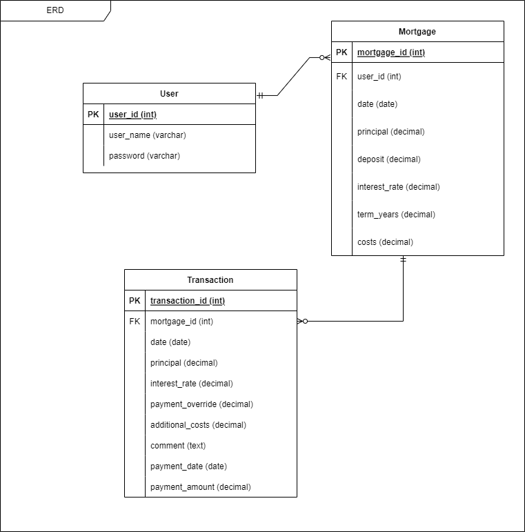
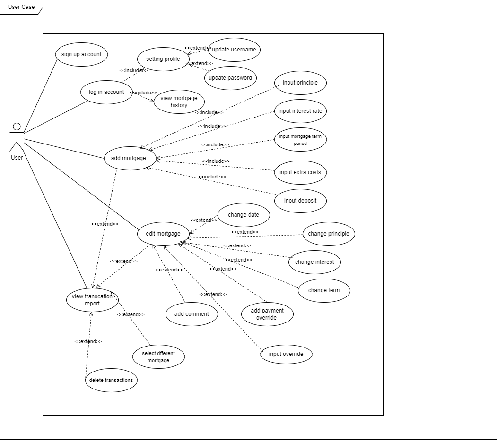
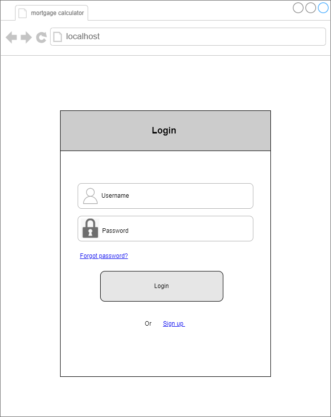

# Software Design Description
## For <project name> Home Loan Monitor</project>

<Institute> Easter Institute of Technology NZ Bachelor of Computing Systems  </Institute>
<course> ITPR7.508 Business Application Programming </course>  
<author>  Katherine Mulder & Alex Borawski </author>  
<date>  20/03/2024 </date>

Table of Contents
=================
- [Software Design Description](#software-design-description)
  - [For  Home Loan Monitor](#for--home-loan-monitor)
- [Table of Contents](#table-of-contents)
  - [Revision History](#revision-history)
  - [1. Introduction](#1-introduction)
    - [1.1 Document Purpose](#11-document-purpose)
    - [1.2 Subject Scope](#12-subject-scope)
    - [1.3 Definitions, Acronyms and Abbreviations](#13-definitions-acronyms-and-abbreviations)
      - [Data Design Diagrams](#data-design-diagrams)
      - [Software Development](#software-development)
  - [2. Analysis/ Reflection of Business Issues](#2-analysis-reflection-of-business-issues)
  - [3. Key areas of software application issues](#3-key-areas-of-software-application-issues)
    - [3.1 Reliability](#31-reliability)
    - [3.2 Scalability](#32-scalability)
    - [3.3 Performance](#33-performance)
    - [3.4 Maintainability](#34-maintainability)
    - [3.5 Security](#35-security)
    - [3.6 Usability](#36-usability)
    - [3.7 Compatibility](#37-compatibility)
  - [4. Analysis \& Reflection of the Program Specifications](#4-analysis--reflection-of-the-program-specifications)
    - [4.1 Graphical User Interface](#41-graphical-user-interface)
    - [4.2 Identification / Authorization](#42-identification--authorization)
    - [3.3 User Accounts](#33-user-accounts)
    - [3.4 Client Relation Features](#34-client-relation-features)
  - [5. System Overview](#5-system-overview)
  - [6. Data Design](#6-data-design)
    - [6.1 Entity Relationship Diagram](#61-entity-relationship-diagram)
    - [6.2 Data Flow Diagram](#62-data-flow-diagram)
  - [7. System Design](#7-system-design)
    - [7.1 User Case Diagram](#71-user-case-diagram)
    - [7.2 Sequence Diagram](#72-sequence-diagram)
    - [7.3 Activity Diagram](#73-activity-diagram)
    - [7.4 Class Diagram](#74-class-diagram)
  - [8. Interface Design](#8-interface-design)
    - [8.1 Wireframes](#81-wireframes)
  - [9. Test Framework](#9-test-framework)
  - [10. Conclusion](#10-conclusion)
- [Software Design Description](#software-design-description)
  - [For  Home Loan Monitor](#for--home-loan-monitor)
- [Table of Contents](#table-of-contents)
  - [Revision History](#revision-history)
  - [1. Introduction](#1-introduction)
    - [1.1 Document Purpose](#11-document-purpose)
    - [1.2 Subject Scope](#12-subject-scope)
    - [1.3 Definitions, Acronyms and Abbreviations](#13-definitions-acronyms-and-abbreviations)
      - [Data Design Diagrams](#data-design-diagrams)
      - [Software Development](#software-development)
  - [2. Analysis/ Reflection of Business Issues](#2-analysis-reflection-of-business-issues)
  - [3. Key areas of software application issues](#3-key-areas-of-software-application-issues)
    - [3.1 Reliability](#31-reliability)
    - [3.2 Scalability](#32-scalability)
    - [3.3 Performance](#33-performance)
    - [3.4 Maintainability](#34-maintainability)
    - [3.5 Security](#35-security)
    - [3.6 Usability](#36-usability)
    - [3.7 Compatibility](#37-compatibility)
  - [4. Analysis \& Reflection of the Program Specifications](#4-analysis--reflection-of-the-program-specifications)
    - [4.1 Graphical User Interface](#41-graphical-user-interface)
    - [4.2 Identification / Authorization](#42-identification--authorization)
    - [3.3 User Accounts](#33-user-accounts)
    - [3.4 Client Relation Features](#34-client-relation-features)
  - [5. System Overview](#5-system-overview)
  - [6. Data Design](#6-data-design)
    - [6.1 Entity Relationship Diagram](#61-entity-relationship-diagram)
    - [6.2 Data Flow Diagram](#62-data-flow-diagram)
  - [7. System Design](#7-system-design)
    - [7.1 User Case Diagram](#71-user-case-diagram)
    - [7.2 Sequence Diagram](#72-sequence-diagram)
    - [7.3 Activity Diagram](#73-activity-diagram)
    - [7.4 Class Diagram](#74-class-diagram)
  - [8. Interface Design](#8-interface-design)
    - [8.1 Wireframes](#81-wireframes)
  - [9. Test Framework](#9-test-framework)
  - [10. Conclusion](#10-conclusion)

## Revision History
| Name | Date    | Reason For Changes  | Version   |
| ---- | ------- | ------------------- | --------- |
|      |         |                     |           |
|      |         |                     |           |
|      |         |                     |           |

## 1. Introduction 
> The following Software Design Description document outlines the design and architecture of a proposed Home Loan Monitor Tool. This tool aims to simplify mortgage management processes for individuals by offering a user-friendly interface and comprehensive features. It's important to note that this proposal is intended for personal use only and is not designed for financial advisers or professional consultation.   
The SDD serves as a detailed guide for developers, stakeholders, and users, providing insights into the software's functionality, structure, and behavior. This including data design, system design, interface design, and testing framework.  
>

### 1.1 Document Purpose
The reason we're writing this document is to explain how the Home Loan Monitor Tool will work and how it's built. We want to make it easy for everyone involved to understand how the software will function and what it will look like.

* Users/ Project manager: This document serves as a guide for both project managers and users of the home loan management tool. It provides the software's functionality, design rationale, usability aspects, and system behavior. By understanding these details, users and project manager can make informed decisions about the project, while users can utilize the software to meet their needs.
* Developers: This guide helps developers understand how the software is designed, the important decisions made about its structure, and how it's built. It's like a roadmap for them to turn requirements into a working program.

### 1.2 Subject Scope

**Scope Summary:**
- **Project Includes:**
1. Development of a mortgage calculator module enabling users to calculate monthly or fortnightly payments based on loan amount, interest rate, and loan term.
2. Incorporation of the ability to compare multiple loans and interest rates.
3. Enable users to input variable interest rates over specific periods and automatically update mortgage calculations, as well as to add extra payments or additional costs.
4. Inclusion of a feature to view historical mortgage data.
5. Support for managing multiple mortgages, allowing users to handle multiple properties.
6. Addition of a chart to display mortgage data.
7. Provision of user-friendly interface webpages.
8. Inclusion of thorough testing procedures to ensure the software functions as expected and meets quality standards.
9. Implementation of authentication features for multi-user access.
10. Provision of comprehensive documentation covering usage instructions.
11. Design of the software with scalability and performance in mind to handle a growing user base and large datasets.
12. Analysis & Reflection of Business Issues.
  
- **Project Excludes:**
1. The actual deployment of the website onto designated servers.
2. Extensive SEO services such as keyword research, on-page optimization, or link building.
3. Custom graphic design services beyond the scope of interface design and layout.
4. The necessary maintenance and updates for the software post-project completion.
5. Advanced financial analysis beyond basic mortgage calculations, such as investment analysis, risk assessment, or portfolio management.
6. Legal advice related to mortgages, including contract terms, legal obligations, or regulatory compliance. Users would need to consult legal professionals for such matters.
7. Property valuation services, including home appraisals or estimates of property values.
8. Tax advice or calculations of property taxes. Users would need to consult with tax professionals or refer to relevant tax regulations.
9. While homeowners’ insurance and mortgage insurance are integral to homeowners, the software will not calculate insurance premiums.
10. Integration with banking systems, financial institutions, or real estate databases.
11. Detailed analytics or reporting features beyond basic mortgage calculations will be excluded.
12. Complex mortgage types, such as adjustable-rate mortgages (ARMs) with various index rates and margins, will be excluded for simplicity.

### 1.3 Definitions, Acronyms and Abbreviations

#### Data Design Diagrams 
1. **ERD**:
   - Definition: Entity-Relationship Diagram.
   - Description: A visual representation of the entities and relationships within a database. It illustrates how entities relate to each other within a database model.

2. **DFD**:
   - Definition: Data Flow Diagram.
   - Description: A graphical representation that shows the flow of data within a system. It visualizes the processes, data stores, and data flows involved in a system or business process.

#### Software Development 
1. **Python**:
   - Definition: Python is a high-level, interpreted programming language known for its simplicity and readability. It supports multiple programming paradigms, including procedural, object-oriented, and functional programming.

2. **Flask Framework**:
   - Definition: Flask is a micro web framework written in Python.
   - Description: Flask provides tools, libraries, and technologies for building web applications. It is lightweight and modular, allowing developers to add only the components they need. Flask is known for its simplicity and flexibility.

3. **Postgres**:
   - Definition: PostgreSQL.
   - Description: PostgreSQL is an open-source relational database management system (RDBMS) known for its reliability, robustness, and advanced features. It supports SQL and is highly extensible, allowing users to define custom data types, functions, and more.

4. **Pytest**:
   - Definition: Pytest is a testing framework for Python.
   - Description: Pytest is a popular testing framework used for writing simple and scalable test cases in Python. It supports fixtures, parameterized testing, and assertions, making it suitable for testing various types of applications and libraries.

5. **HTML**:
     - Definition: HTML stands for Hypertext Markup Language. It is the standard markup language used to create and design web pages.
     - Description: HTML provides the basic structure and elements necessary to organize and present content on the World Wide Web.

6. **CSS**:
   - Definition: Cascading Style Sheets (CSS) is a style sheet language used to describe the presentation of a document written in HTML. 
   - Description: It allows web developers to control the layout, formatting, and appearance of multiple web pages at once by separating the content from its visual representation.

7. **Bootstrap**:
   - Definition: Bootstrap is a front-end framework for building responsive and mobile-first websites.
   - Description: Bootstrap's grid system, CSS styles, and JavaScript plugins allow developers to create visually appealing and user-friendly websites with minimal effort.

8. **JavaScript**:
   - Definition: JavaScript is a high-level programming language primarily used for creating dynamic and interactive web content.
   - Description: Enables developers to add interactivity, behavior, and functionality to web pages.

## 2. Analysis/ Reflection of Business Issues

## 3. Key areas of software application issues

### 3.1 Reliability 
### 3.2 Scalability
### 3.3 Performance
### 3.4 Maintainability
### 3.5 Security
### 3.6 Usability 
### 3.7 Compatibility

## 4. Analysis & Reflection of the Program Specifications

### 4.1 Graphical User Interface
### 4.2 Identification / Authorization
### 3.3 User Accounts 
### 3.4 Client Relation Features 

## 5. System Overview 
> A guide to understanding a system. It tells you what the system does, who uses it, and how it works. 
> It also mentions things like its parts, how it connects to other systems, what technology it uses, and how it's kept secure and working well. 
> It's like a map that helps you get the big picture before diving into the details.
> In the system overview selection here will provide datat design, system design and interface design.

## 6. Data Design
### 6.1 Entity Relationship Diagram
> The purpose of the Entity-Relationship Diagram (ERD) is to visually represent the structure of the database for the home loan monitor. By mapping out entities like "User," "mortgage," "override payment,"and so on, along with their attributes and relationships, the ERD will provide a clear understanding of how data is organized within the system. This visualization will aid in the design and development of the tool, ensuring it effectively manages home loans by calculating payments, tracking interest rates, and facilitating management of multiple mortgages.  

> 
### 6.2 Data Flow Diagram
> The Data Flow Diagram (DFD) serves to illustrate the flow of data within the system, showing how data is input, processed, and output. It helps in understanding the flow of information and the interactions between different components within the software.  

> 

## 7. System Design 
### 7.1 User Case Diagram
> The use case diagram outlines the interactions between users and the system, including the primary functions such as calculating mortgage payments, viewing amortization schedules, adjusting parameters, and accessing mortgage features. 
> 

### 7.2 Sequence Diagram
> The sequence diagram is a visual story that shows how different parts of a system interact with each other over time.
> Each object or component is represented by a box, and the messages or actions between them are shown as arrows. This diagram helps developers understand the order in which things happen in a system and how they're related to each other.

### 7.2 Component Diagram
> 

### 7.3 Activity Diagram
>The activity diagram is the sequence of actions involved in performing tasks such as inputting data, calculating mortgage payments, viewing amortization schedules, adjusting parameters, and so on. Each activity is connected through transitions, showing the flow of control within the system. 
> 1. User login activity diagram
>  
> 2. User update mortgage activity diagram
> 
> 3. User viewing mortgage activity diagram
> 
### 7.4 Class Diagram
> 
## 8. Interface Design
### 8.1 Wireframes
A skeletal outline of the webpage, those wireframes shows the structure and placement of elements. 
  **User login page** 
when users open up the webpage. This log in page will display before entry the calculator.
This page gives users options for log in as existing user, sign up an account or try it out as a first user before sign up.
> 

  **Sign up page**: When user click sign up link, the sign up page will appear for users to sign up an account.
In this page will grab user's username and password details. Alternately, User can still log in if they remember their log in details after enter this page or they can try the calculator without an account.
> 

  **Forgot password page**: 
When user click forgot password the first process will ask user to input their surename.

Next, The rest password page will appear.

when user input incorrect password. A indication text will appear.

Once the password is reset, the system will direct user back to log in page.

  **Input error shake effect**:
All the user account setting pages has input error effect indication for invalid inputs.
> 
> 

  **First time calculation page**: After the user logs in or clicks the 'Try it out' button, the dashboard page will be displayed.
This page allows users to input new mortgage information for the first initial payment and find out the override payment before add extra payment for further analysis.
> 

  **Warning indications**: Confirm the user's action and prevent accidental deletion of entered data.
Input data type will be set to prevention data input errors.
> 

  **Override mortgage page**: When user click for more analysis button after the initial calculation, the override payment calculator will appear.
User can decide if they want to input override payment or not. 
User will need to click show analysis for display the amortization.
> 

  **Amortization page**: User will be able to view their mortgages. The first session will display the previous mortgage and the second session will display the most recent mortgage.
   _Note_: for the existing users, once user log in successfully, the transaction page will appear after log in. To be able to add new mortgage, there is add new mortgage button on the bottom right for adding more mortgages.
> 

 
  **User settings page**: On the top right, there is a user icon where user can click for change user name or password. 
When user click the icon, a pop-up window will appear for user to select more options.
> 

_Note_: 
* When use click account setting, it will direct user to the account setting page.
* When user click view history button, it will direct user to the amortization page.
* When user click change password button, it will direct user to the update password page. 

## 9. Test Framework

## 10. Conclusion
