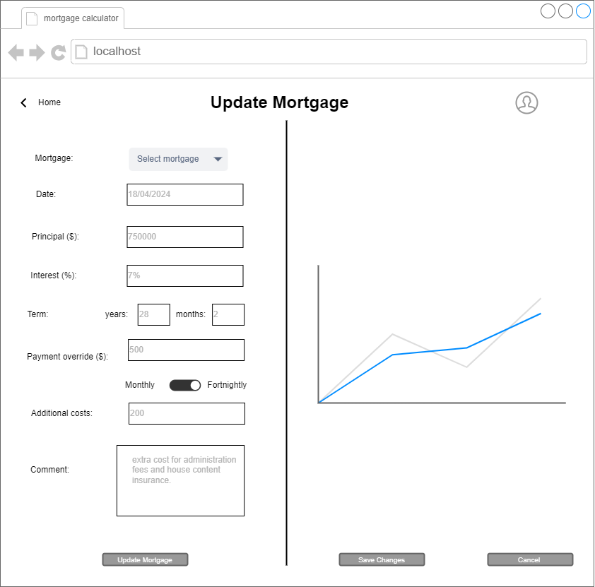

# Software Design Description
## For <project name> Home Loan Monitor</project>

<Institute> Easter Institute of Technology NZ Bachelor of Computing Systems  </Institute>
<course> ITPR7.508 Business Application Programming </course>  
<author>  Katherine Mulder & Alex Borawski </author>  
<date>  20/03/2024 </date>

Table of Contents
=================
- [Software Design Description](#software-design-description)
  - [For  Home Loan Monitor](#for--home-loan-monitor)
- [Table of Contents](#table-of-contents)
  - [Revision History](#revision-history)
  - [1. Introduction](#1-introduction)
    - [1.1 Document Purpose](#11-document-purpose)
    - [1.2 Subject Scope](#12-subject-scope)
    - [1.3 Definitions, Acronyms and Abbreviations](#13-definitions-acronyms-and-abbreviations)
      - [Data Design Diagrams](#data-design-diagrams)
    - [1.4 Software Development](#14-software-development)
  - [2. Analysis/ Reflection of Business Issues](#2-analysis-reflection-of-business-issues)
  - [3. Key areas of software application issues](#3-key-areas-of-software-application-issues)
    - [3.1 Reliability](#31-reliability)
    - [3.2 Scalability](#32-scalability)
    - [3.3 Performance](#33-performance)
    - [3.4 Maintainability](#34-maintainability)
    - [3.5 Security](#35-security)
    - [3.6 Usability](#36-usability)
    - [3.7 Compatibility](#37-compatibility)
  - [4. Analysis \& Reflection of the Program Specifications](#4-analysis--reflection-of-the-program-specifications)
    - [4.1 Graphical User Interface](#41-graphical-user-interface)
    - [4.2 Identification / Authorization](#42-identification--authorization)
    - [3.3 User Accounts](#33-user-accounts)
    - [3.4 Client Relation Features](#34-client-relation-features)
  - [5. System Overview](#5-system-overview)
  - [6. Data Design](#6-data-design)
    - [6.1 Entity Relationship Diagram](#61-entity-relationship-diagram)
    - [6.2 Data Flow Diagram](#62-data-flow-diagram)
  - [7. System Design](#7-system-design)
    - [7.1 User Case Diagram](#71-user-case-diagram)
    - [7.2 Sequence Diagram](#72-sequence-diagram)
    - [7.3 Activity Diagram](#73-activity-diagram)
    - [7.4 Class Diagram](#74-class-diagram)
  - [8. Interface Design](#8-interface-design)
    - [8.1 Wireframes](#81-wireframes)
  - [9. Test Framework](#9-test-framework)
  - [10. Conclusion](#10-conclusion)
- [Software Design Description](#software-design-description)
  - [For  Home Loan Monitor](#for--home-loan-monitor)
- [Table of Contents](#table-of-contents)
  - [Revision History](#revision-history)
  - [1. Introduction](#1-introduction)
    - [1.1 Document Purpose](#11-document-purpose)
    - [1.2 Subject Scope](#12-subject-scope)
    - [1.3 Definitions, Acronyms and Abbreviations](#13-definitions-acronyms-and-abbreviations)
      - [Data Design Diagrams](#data-design-diagrams)
      - [Software Development](#software-development)
  - [2. Analysis/ Reflection of Business Issues](#2-analysis-reflection-of-business-issues)
  - [3. Key areas of software application issues](#3-key-areas-of-software-application-issues)
    - [3.1 Reliability](#31-reliability)
    - [3.2 Scalability](#32-scalability)
    - [3.3 Performance](#33-performance)
    - [3.4 Maintainability](#34-maintainability)
    - [3.5 Security](#35-security)
    - [3.6 Usability](#36-usability)
    - [3.7 Compatibility](#37-compatibility)
  - [4. Analysis \& Reflection of the Program Specifications](#4-analysis--reflection-of-the-program-specifications)
    - [4.1 Graphical User Interface](#41-graphical-user-interface)
    - [4.2 Identification / Authorization](#42-identification--authorization)
    - [3.3 User Accounts](#33-user-accounts)
    - [3.4 Client Relation Features](#34-client-relation-features)
  - [5. System Overview](#5-system-overview)
  - [6. Data Design](#6-data-design)
    - [6.1 Entity Relationship Diagram](#61-entity-relationship-diagram)
    - [6.2 Data Flow Diagram](#62-data-flow-diagram)
  - [7. System Design](#7-system-design)
    - [7.1 User Case Diagram](#71-user-case-diagram)
    - [7.2 Sequence Diagram](#72-sequence-diagram)
    - [7.3 Activity Diagram](#73-activity-diagram)
    - [7.4 Class Diagram](#74-class-diagram)
  - [8. Interface Design](#8-interface-design)
    - [8.1 Wireframes](#81-wireframes)
  - [9. Test Framework](#9-test-framework)
  - [10. Conclusion](#10-conclusion)

## Revision History
| Name | Date    | Reason For Changes  | Version   |
| ---- | ------- | ------------------- | --------- |
|      |         |                     |           |
|      |         |                     |           |
|      |         |                     |           |

## 1. Introduction 
> The following Software Design Description document outlines the design and architecture of a proposed Home Loan Monitor Tool. This tool aims to simplify mortgage management processes for individuals by offering a user-friendly interface and comprehensive features. It's important to note that this proposal is intended for personal use only and is not designed for financial advisers or professional consultation.   
The SDD serves as a detailed guide for developers, stakeholders, and users, providing insights into the software's functionality, structure, and behavior. This including data design, system design, interface design, and testing framework.  
>

### 1.1 Document Purpose
The reason we're writing this document is to explain how the Home Loan Monitor Tool will work and how it's built. We want to make it easy for everyone involved to understand how the software will function and what it will look like.

* Users/ Project manager: This document serves as a guide for both project managers and users of the home loan management tool. It provides the software's functionality, design rationale, usability aspects, and system behavior. By understanding these details, users and project manager can make informed decisions about the project, while users can utilize the software to meet their needs.
* Developers: This guide helps developers understand how the software is designed, the important decisions made about its structure, and how it's built. It's like a roadmap for them to turn requirements into a working program.

### 1.2 Subject Scope

**Scope Summary:**
- **Project Includes:**
> The home loan monitor will contain the following key functionalities:

The home loan monitor will contain the following key functionalities:
1.	Initial set up: 
•	Users can input principal amounts, interest rates, term years, additional costs, and deposit to initiate a mortgage. 
Scope: This functionality covers the setup process for creating a new mortgage with all necessary details required for calculation and management. It's important to make sure that users can easily navigate through this setup process and that it accommodates various types of mortgages and inputs.

2.	Update mortgage: 
•	Users have the ability to modify existing mortgage details, including changing dates, principals, interest rates, terms, overriding payments, and adding comments to transactions.
Scope: This functionality allows users to make changes to existing mortgage, providing flexibility to accommodate changes in financial circumstances or terms of the loan. Make sure that the system accurately reflects any changes made by users.

3.	Transaction reporting: the system: 
•	The system will generate transaction reports, providing users with their mortgage activities and financial obligations. 
Scope: This functionality involves generating detailed reports that summarize mortgage transactions, helping users track their payment history, outstanding balances, and other relevant financial information.
Make sure the reports are easy to understand and allowing users to insight into their mortgage transactions.

4.	Mortgage editing: 
•	Users can edit mortgage details, such as adjusting dates to accommodate extra payments or deleting payments as needed.
Scope: This functionality enables users to make adjustments to specific aspects of their mortgage agreements, such as payment schedules or loan terms, to better suit their needs or preferences. 
Ensure proper validation to prevent erroneous changes and maintain data accuracy and consistency.

5.	Authentication:
•	Users can create an account to store their transactions as well as change the username and password.
Scope: This functionality involves implementing user authentication and account management features.
•	Ensure that users can easily manage their account without encountering any usability issues. 

6.	Visualization chart:
•	Provide a graphical chart to visually represent key mortgage data and changes.
Scope: Implement a graphical chart feature within the system interface to display important metrics such as the amortization schedule, loan balance over time, or payment breakdown (principal vs. interest).

  
- **Project Excludes:**
1.	Complex mortgage type:
•	Adjustable-rate mortgages (ARMs) with various index rates and margins, will be excluded for simplicity.
Scope: The project will focus on standard mortgage types and will exclude complex mortgage variations for simplicity and clarity.

2.	 Deployment:
•	The actual deployment of the website onto designated servers.
Scope: The project will focus on developing the website and its functionalities but will not involve the deployment process onto live servers.

3.	SEO services:
•	Extensive SEO services such as keyword research, on-page optimization, or link building.
Scope: The project will not include SEO services beyond basic considerations for website visibility. Specific SEO tasks will be excluded from the scope.

4.	Maintenance and updates:
•	The necessary maintenance and updates for the software post-project completion.
Scope: Post-project maintenance and updates will not be covered under this project. This includes ongoing software support and updates.

5.	Advanced financial analysis: 
•	Advanced financial analysis beyond basic mortgage calculations, such as investment analysis, risk assessment, or portfolio management.
Scope: The project will focus solely on basic mortgage calculations and will not include advanced financial analysis features.

6.	Legal advice:
•	Legal advice related to mortgages, including contract terms, legal obligations, or regulatory compliance.
Scope: Users will need to seek legal advice from professionals for any legal matters related to mortgages.

7.	Tax advice: 
•	Tax advice or calculations of property taxes.
Scope: Users will need to consult with tax professionals or refer to relevant tax regulations for any tax-related matters.

8.	Integration with external systems:
•	Integration with banking systems, financial institutions, or real estate databases.
Scope: The project will not include integration with external systems beyond the scope of basic mortgage functionalities.

### 1.3 Definitions, Acronyms and Abbreviations

#### Data Design Diagrams 
1. **ERD**:
   - Definition: Entity-Relationship Diagram.
   - Description: A visual representation of the entities and relationships within a database. It illustrates how entities relate to each other within a database model.

2. **DFD**:
   - Definition: Data Flow Diagram.
   - Description: A graphical representation that shows the flow of data within a system. It visualizes the processes, data stores, and data flows involved in a system or business process.

### 1.4  Software Development  
1. Python:
Backend logic and data processing.
2. Flask (Web Framework):
Handling HTTP requests and responses.
Routing URLs to appropriate functions.
Serving HTML templates.
3. HTML, CSS, Bootstrap (Frontend):
Structuring and styling the user interface.
Utilizing Bootstrap for responsive design and pre-styled components.
4. JavaScript:
Implementing client-side interactivity (optional).
Validating user inputs.
5. Pytest (Testing Framework):
Writing and running unit tests to ensure code quality and functionality.
6. Postgres:
Storing mortgage data.
Managing transactions and updates.

## 2. Analysis/ Reflection of Business Issues
The main purpose of this software is to develop a mortgage calculator capable of tracking multiple transactions and providing insights into mortgage maturity. We have decided to use a programming language to develop this software throughout the entire project. 
We will provide software design description documentation to provide more in-depth technical information. From the users' views and expectations, the ultimate goal is to be able to track multiple mortgages and figure out how much actual savings can be achieved by making extra payments.
For each functionality:
1.	The first stage of initial set-up:
•	Analysis: The initial setup process is crucial as it sets the foundation for the entire mortgage management system. Users need to input key details accurately to ensure the calculations and management of their mortgage are done correctly.
•	Reflection: To address this business issue the system must prioritize simplicity and straightforwardness in the setup process. Providing clear guidance and validation checks can help mitigate errors and ensure users start their mortgage journey smoothly.

2.	Update mortgage: 
•	Analysis: Changes in financial circumstances or loan terms are common occurrences for mortgage holders. Users need the flexibility to update their mortgage details easily and accurately within the system.
•	Reflection: The system needs to empower users with the ability to make these updates. Ensuring that changes are reflected accurately.

3.	Transaction reporting: 
•	Analysis: Transaction reports provide users with insights into their payment history and remaining balances.
•	Reflection: Generating detailed and comprehensible transaction reports is important for users to track their historical data and they will be able to get insights from the reports.

4.	Mortgage editing:
•	Analysis: Mortgage agreements may need adjustments over time to accommodate changes in circumstances or preferences. Users require the ability to edit specific details of their mortgage while maintaining data accuracy and consistency.
•	Reflection: Implementing editing features is essential to meet users' needs.

5.	Visualization chart:
•	Analysis: Visual representations of mortgage data can enhance users' understanding of their financial status and payment trends. Users require graphical charts that provide clear insights into their mortgage details.
•	Reflection: Implementing visual charts can enhance user experience and engagement.

6.	Authentication: 
•	Analysis: Users need a process to create and manage their accounts.
•	Reflection: Building an authentication system that allows users to log in, log out, change passwords, and delete accounts is essential.

Our project is about creating a mortgage calculator that's easy to use for everyone. We're focusing on keeping it simple. If we run into any difficult parts, our lecture will help us figure them out. To deal with the limited time and resources we have, we're breaking the work into smaller tasks with achievable goals. Since our tool is for regular users and doesn't have to follow any special rules, we're making sure it's helpful without adding too many complicated things.

## 3. Key areas of software application issues

### 3.1 Reliability 
### 3.2 Scalability
### 3.3 Performance
### 3.4 Maintainability
### 3.5 Security
### 3.6 Usability 
### 3.7 Compatibility

## 4. Analysis & Reflection of the Program Specifications

### 4.1 Graphical User Interface
### 4.2 Identification / Authorization
### 3.3 User Accounts 
### 3.4 Client Relation Features 

## 5. System Overview 
> A guide to understanding a system. It tells you what the system does, who uses it, and how it works. 
> It also mentions things like its parts, how it connects to other systems, what technology it uses, and how it's kept secure and working well. 
> It's like a map that helps you get the big picture before diving into the details.
> In the system overview selection here will provide datat design, system design and interface design.

## 6. Data Design
### 6.1 Entity Relationship Diagram
> The purpose of the Entity-Relationship Diagram(ERD) is to visually represent the structure of the database for the mortgage calculator,
By mapping out entities like "User," "mortgage," "transaction, along with their attributes and relationships.
The ERD will provide a clear understanding of how data is organized within the system. 

> 
### 6.2 Data Flow Diagram
> The Data Flow Diagram (DFD) serves to illustrate the flow of data within the system, showing how data is input, processed, and output. It helps to understand the flow of information and the interactions between different components within the software.  

> 

## 7. System Design 
### 7.1 User Case Diagram
> The use case diagram outlines the interactions between users and the system, including the primary functions such as calculating mortgage payments, viewing amortization schedules, adjusting parameters, and accessing mortgage features. 
> 

### 7.2 Component Diagram
> The component diagram shows the overview of how the components of our software will be designed and comunicate with each other. As shown in the diagram below, the software will need to communicate externally with Postgres to store the data, which is then handled by the Data Models, ran through the analysis, amortization and graphing components to then produce the interface.  
> 

### 7.3 Activity Diagram
>The activity diagram is the sequence of actions involved in performing tasks such as inputting data, calculating mortgage payments, viewing amortization schedules, adjusting parameters, and so on. Each activity is connected through transitions, showing the flow of control within the system. 
> 1. User login activity diagram
>  
> 2. User update mortgage activity diagram
> 
> 3. User viewing mortgage activity diagram
> 
> 4. User viewing mortgage activity diagram
> 
### 7.4 Class Diagram
> The class diagram shows the structures of the various classes used throughout the application as well as the methods that are inherent to those classes. This helps drive our ovject orientated programming to work smoothly.
> 

## 8. Interface Design
### 8.1 Wireframes
A skeletal outline of the webpage, those wireframes shows the structure and placement of elements. 
  **User login page** 
when users open up the webpage. This log in page will display before entry the calculator.
This page gives users options for log-in and sign-up an account also try it out.
> 

  **Sign up page**: 
In this page will grab user's username and password details. Alternately, User can still log in if they remember their login details after enter this page, or they can try the calculator without an account.
> 

  **Index page**: User will be able to view their transaction reports on this page. Where users can edit payment date, delete transaction, add new mortgage and update mortgage.
 

  **Add mortgage page**: After the user logs in or clicks the 'Try it out' button, the adding new mortgage page will be displayed.
This page allows users to input new mortgage information.
> 

  **update mortgage page**: After a new mortgage is established, user will be able to edit mortgage on this page.
This page will display current mortgage details and allow users to update the information. 
Users can analysis override payment and add extra costs if there is any. A comment textarea for comment on the costs.  
> 

  **Deleting Data Page**: If users wish to delete existing transactions or mortgages, they can access this page through the removing data button on the index page.
They will see a table of both mortgages and transactions with identifying information so that they can remove exactly what they want to remove.
 > 

  **User account settings**: 
The username will display as default and user can change password.
> 

  **User account icon**:
When user clicks the user icon on the top right page then a pop up window will appear for user to update their account information.
> 

## 9. Test Framework
_Unit Testing_
  The main objective is to isolate written code and determine if it works as it should, so we can detect early flaws in code.
We will focus on creating unit test cases before developing the actual code by using automated unit testing for validating the functionality.

## 10. Conclusion
