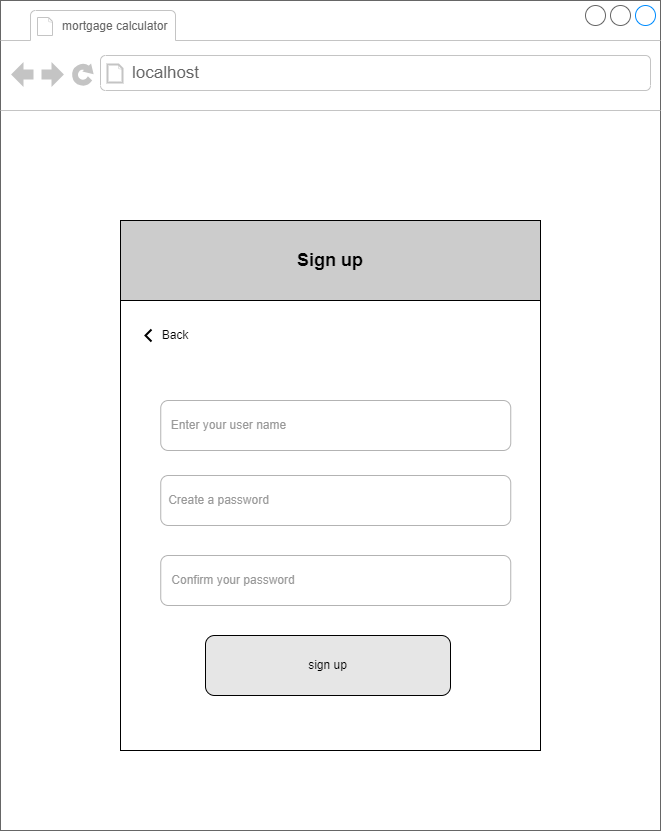
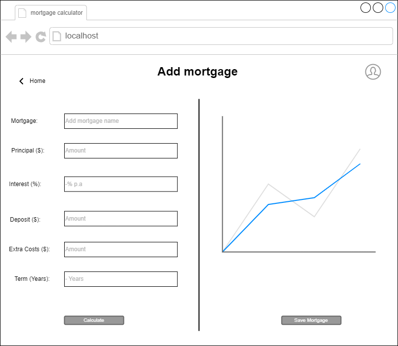
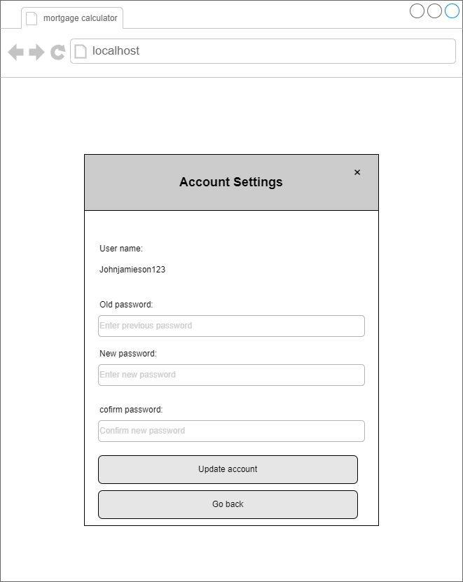

# Software Design Description
## For <project name> Home Loan Monitor</project>
<Institute> Easter Institute of Technology NZ Bachelor of Computing Systems  </Institute>
<course> ITPR7.508 Business Application Programming </course>  
<author>  Katherine Mulder & Alex Borawski </author>  
<date>  20/03/2024 </date>

Table of Contents
=================
- [Software Design Description](#software-design-description)
  - [For  Home Loan Monitor](#for--home-loan-monitor)
- [Table of Contents](#table-of-contents)
  - [Revision History](#revision-history)
  - [1. Introduction](#1-introduction)
    - [1.1 Document Purpose](#11-document-purpose)
    - [1.2 Subject Scope](#12-subject-scope)
  - [2. Analysis/ Reflection of Business Issues](#2-analysis-reflection-of-business-issues)
  - [3. Analysis \& Reflection of the Program Specifications](#3-analysis--reflection-of-the-program-specifications)
    - [3.1 Graphical User Interface](#31-graphical-user-interface)
    - [3.2 User Accounts](#32-user-accounts)
    - [3.3 Data Entry Structure](#33-data-entry-structure)
    - [3.4 Analytical Functionality](#34-analytical-functionality)
    - [3.5 Data Removal Processes](#35-data-removal-processes)
  - [4. Key areas of software application issues](#4-key-areas-of-software-application-issues)
    - [4.1 Reliability](#41-reliability)
    - [4.2 Scalability](#42-scalability)
    - [4.3 Performance](#43-performance)
    - [4.4 Maintainability](#44-maintainability)
    - [4.5 Security](#45-security)
    - [4.6 Usability](#46-usability)
    - [4.7 Compatibility](#47-compatibility)
  - [5. System Overview](#5-system-overview)
    - [5.1 Software Development](#51-software-development)
  - [6. Data Design](#6-data-design)
    - [6.1 Entity Relationship Diagram](#61-entity-relationship-diagram)
    - [6.2 Data Flow Diagram](#62-data-flow-diagram)
  - [7. System Design](#7-system-design)
    - [7.1 User Case Diagram](#71-user-case-diagram)
    - [7.2 Sequence Diagram](#72-sequence-diagram)
    - [7.3 Activity Diagram](#73-activity-diagram)
    - [7.4 Class Diagram](#74-class-diagram)
  - [8. Interface Design](#8-interface-design)
    - [8.1 Wireframes](#81-wireframes)
  - [9. Test Framework](#9-test-framework)
  - [10. Conclusion](#10-conclusion)
  - [11. Definitions, Acronyms and Abbreviations](#11-definitions-acronyms-and-abbreviations)
      - [Data Design Diagrams](#data-design-diagrams)
## Revision History
| Name | Date    | Reason For Changes  | Version   |
| ---- | ------- | ------------------- | --------- |
|      |         |                     |           |
|      |         |                     |           |
|      |         |                     |           |
## 1. Introduction 
> The following Software Design Description document outlines the design and architecture of a proposed Home Loan Monitor Tool. This tool aims to simplify mortgage management processes for individuals by offering a user-friendly interface and comprehensive features. It's important to note that this proposal is intended for personal use only and is not designed for financial advisers or professional consultation.   
The SDD serves as a detailed guide for developers, stakeholders, and users, providing insights into the software's functionality, structure, and behavior. This including data design, system design, interface design, and testing framework.  
### 1.1 Document Purpose
The reason we're writing this document is to explain how the Home Loan Monitor Tool will work and how it's built. We want to make it easy for everyone involved to understand how the software will function and what it will look like.
We have also conducted a user required specifications document defines what users expect from this project.
* Users/ Project manager: This document serves as a guide for both project managers and users of the mortgage management tool. It provides the software's functionality, design rationale, usability aspects, and system behavior. By understanding these details, users and project manager can make informed decisions about the project, while users can utilize the software to meet their needs.
* Developers: This guide helps developers understand how the software is designed, the important decisions made about its structure, and how it's built. It's like a roadmap for them to turn requirements into a working program.
### 1.2 Subject Scope
**Scope Summary:**
- **Project Includes:**
The home loan monitor will contain the following key functionalities:
> 1.	Initial set up: 
•	Users can input principal amounts, interest rates, term years, additional costs, and deposit to initiate a mortgage. 
Scope: This functionality covers the setup process for creating a new mortgage with all necessary details required for calculation and management. It's important to make sure that users can easily navigate through this setup process and that it accommodates various types of mortgages and inputs.
> 2.	Update mortgage: 
•	Users have the ability to modify existing mortgage details, including changing the principal, interest rates, terms, overriding payments, and adding comments to transactions.
Scope: This functionality allows users to make changes to existing mortgage, providing flexibility to accommodate changes in financial circumstances or terms of the loan. Make sure that the system accurately reflects any changes made by users.
> 3.	Transaction reporting: the system: 
•	The system will generate transaction reports, providing users with their mortgage activities and financial obligations. 
Scope: This functionality involves generating detailed reports that summarize mortgage transactions, helping users track their payment history, outstanding balances, and other relevant financial information.
Make sure the reports are easy to understand and allowing users to insight into their mortgage transactions.
> 4.	Mortgage editing: 
•	Users can edit mortgage details, such as adjusting extra payments or deleting payments as needed.
Scope: This functionality enables users to make adjustments to specific aspects of their mortgage agreements, such as payment schedules or loan terms, to better suit their needs or preferences. 
Ensure proper validation to prevent erroneous changes and maintain data accuracy and consistency.
> 5.	Authentication:
•	Users can create an account to store their transactions as well as change the username and password.
Scope: This functionality involves implementing user authentication and account management features.
•	Ensure that users can easily manage their account without encountering any usability issues. 
> 6.	Visualization chart:
•	Provide a graphical chart to visually represent key mortgage data and changes.
Scope: Implement a graphical chart feature within the system interface to display important metrics such as the amortization schedule, loan balance over time, or payment breakdown (principal vs. interest). 
- **Project Excludes:**
> 1.	Complex mortgage type:
Adjustable-rate mortgages (ARMs) with various index rates and margins, will be excluded for simplicity.
Scope: The project will focus on standard mortgage types and will exclude complex mortgage variations for simplicity and clarity.
> 2.	Deployment:
•	The actual deployment of the website onto designated servers.
Scope: The project will focus on developing the website and its functionalities but will not involve the deployment process onto live servers.
> 3.	SEO services:
•	Extensive SEO services such as keyword research, on-page optimization, or link building.
Scope: The project will not include SEO services beyond basic considerations for website visibility. Specific SEO tasks will be excluded from the scope.
> 4.	Maintenance and updates:
•	The necessary maintenance and updates for the software post-project completion.
Scope: Post-project maintenance and updates will not be covered under this project. This includes ongoing software support and updates.
> 5.	Advanced financial analysis: 
•	Advanced financial analysis beyond basic mortgage calculations, such as investment analysis, risk assessment, or portfolio management.
Scope: The project will focus solely on basic mortgage calculations and will not include advanced financial analysis features.
> 6.	Legal advice:
•	Legal advice related to mortgages, including contract terms, legal obligations, or regulatory compliance.
Scope: Users will need to seek legal advice from professionals for any legal matters related to mortgages.
> 7.	Tax advice: 
•	Tax advice or calculations of property taxes.
Scope: Users will need to consult with tax professionals or refer to relevant tax regulations for any tax-related matters.
> 8.	Integration with external systems:
•	Integration with banking systems, financial institutions, or real estate databases.
Scope: The project will not include integration with external systems beyond the scope of basic mortgage functionalities.
## 2. Analysis/ Reflection of Business Issues
1. Business Objectives:  Our main goal is to develop a user-friendly mortgage calculator for individuals. This tool will help them accurately estimate their mortgage payments based on factors like loan amount, interest rate, and loan term.
2. Business Processes: Our software will simplify the process of estimating mortgage payments. Users will be able to input their loan details, and the software will automatically calculate and present the results clearly.
3. Regulatory and Compliance Requirements: Since the software is for individual use, it doesn't fall under specific financial regulations.
4. Risk Analysis: There are some technical risks due to our team's limited experience, but we can manage these with guidance from our lecture. Limited resources and time pose business risks, so we need to make sure to meet the declines.
5. Reflection on Business Issues: Our project aligns well with our team's abilities. Guidance from our instructor will help us overcome challenges. We're focusing on creating value for individual users without unnecessary complexity.
6. Recommendations: Prioritize simplicity and usability. Maintain regular communication with our lecture for guidance. Break the project into manageable tasks with realistic milestones for tracking progress.
_Note: Please read URS for more information_
## 3. Analysis & Reflection of the Program Specifications
### 3.1 Graphical User Interface
The users will be greeted with a login pafge to be able to access their accounts. Their will also be a seperate page to create an account. Alongside this, once logged into the application, there will be a user settings page to allow for a password change or to delete thier account 
The program needs to have a simple interface desgined to quickly provide analysis of a mortgage. To be able to do this, the main page of the application needs to contain all of the information relating to the analysis of the mortgage, primarily a table of summarised analysis, a graph showing the change in equity over time, and an amortization table showing specific timestamped information. 
There also needs to be a seperate interface to allow for the creation of a mortgage and transaction. Due to the amount of information required for each of these sections, the will need their own page. The user then should be able to see some of the analysis for the information they enter beofre saving it permenately and return to the home page. 
Lastly, there will be a page to allow users to remove mortages and transactions that they want to remove, listing them out showing identifying information so that they can correct select which ones to remove.
### 3.2 User Accounts
User Accounts will be implemented in the software to seperate mortgages (and subsequtially transactions) from others users, with no access whatsoever being allowed between users. These accounts will require a password to be made in order to secure the account. Primarily due to the scale of the project, there is no plans to include an admin account to access and manage users from within the application itself, but there will be a way to acess the information from the database end, allowing changes to be made there if neccessary.
### 3.3 Data Entry Structure
With the calculator requiring a lot of specific information for both the mortgage and transaction, the structure that the entry will be keep simple and straightforward to help users correctly entry information into the right field. All entry fields will have a description next to their titles outlining correct formatting. Additionally, the entry fields in the transaction creation screen will include automatically inputted data from the mortgage that is selected so the users only need to adjust the information in the fields that need changes. Lastly, if any information is entered incorrectly, the entry fields will highlight red and a small error message will be displayed to let the user know that something in this field is wrong.
### 3.4 Analytical Functionality
The application will need to handle a lot of analysis and most of it will be done as a user creates a mortgage or transaction to show in the page before a user confirms this is correct. This analysis will include the Estimated Repayment, a payment breakdown of interest and principal and information regarding the mortgage maturity (including payments over full term, full term to amortize, interest over the full term and principal + interest). It is important to understand that in the transaction creation screen there will be added information to showcase any extra payements, the payments over the reduced term, Estimated reduced term to amortize, interest over the reduced term, interest saved over the reduced term and principal + interest over the reduced term. 
Then this information will then be used to generate a graph (viewable on both the main page and creation pages) and an Amortization table (main page only) based on the state of the mortgage. The state will be determined by combining the inital state of the mortage and applying any transactional changes that have occured to it at the correct time. Users will also be able to apply a date to the analysis on the main page, only seeing the start of the mortgage from that starting data.
### 3.5 Data Removal Processes
Another important function of the application will be the ability to remove data from the system. User will be able to remove any mortgages or transactions they want through a single page which will show a table for each type of data, containing all of their entries. Transactions will show the date they were applied from, a comment on the purpose of the transaction, and the mortgage that it relates to. For mortgages, it will show the start date of the mortage, the name given to the mortgage as well as the current balance remaining on the mortgage. Then, next to all of thees entries will be a delete button that if clicked will show a popup confirming the deletion of the selected entry, and if yes is selected the data will be removed. 
There will also be a way to completely delete the account if the user decides to. This option will be accessable under the user setting page, and if selected and confirmed it will delete the account and return the to the login page. 
For all these forms of data removal, if data that is reliant on that deleted entry exists, it will also be removed, e.g. if a user deleted a mortgage, all connected transactions will be removed as well.
## 4. Key areas of software application issues
There is some important areas our software will need to be able handle/work with in order to deliver a complete solution to the client.
### 4.1 Reliability 
Because we are working with fincancial information, we need to do our best to ensure that our application runs reliably. With this in mind, we need to make sure that our application correctly handles any mathmatical data that is given to ensure accurate results as this is the core functionality of the calculator. The most common areas that could impede this is with rounding errors or inputing data that is out of the range of the expected field. The best way to overcome this is to include robust error checking in our code to ensure that this is mitigated as much as possible. This theme should be extended throughout the software, in order to make sure that the program is reliable as possible. More information about this will be available in our Test framework which will show how we intend to prove that our application catches these errors effectively.
### 4.2 Scalability
Although this software isnt intended to be scaled up to a larger audience, designing the code in a way that allows added features to be included is important to allow for future flexibility of the program. To allow for this, deisgning the code to be more modular, with set definitions for classes and different aspects of the code, it will allow future developers to be able to more efficently make adjustments to the code to suit their needs. Another way to allow for future scalability is through the design of the application as a whole, creating an application environment that can be easily integrated into more wide reaching framework.
### 4.3 Performance
  - Responsetimes, Throughtput/Scalability
  - Bottlenecks performance issues
### 4.4 Maintainability
  - Maintainability, modularity and extensibility
  - Code Standards, documentation requirements and version control
  - How changes and updates will be handled
### 4.5 Security
  - Identifying vulnerabilities and threats
  - Define measures to protect data and unauthorised access
  - Authentication, authorization, encryption and data privacy
### 4.6 Usability 
  - UI/UX design
  - Accessability and navigation
### 4.7 Compatibility
  - Address different compatibilities
## 5. System Overview 
> A guide to understanding a system. It tells you what the system does, who uses it, and how it works. 
> It also mentions things like its parts, how it connects to other systems, what technology it uses, and how it's kept secure and working well. 
> It's like a map that helps you get the big picture before diving into the details.
> In the system overview selection here will provide datat design, system design and interface design.
### 5.1  Software Development  
1. Python:
Backend logic and data processing.
2. Flask (Web Framework):
Handling HTTP requests and responses.
Routing URLs to appropriate functions.
Serving HTML templates.
3. HTML, CSS, Bootstrap (Frontend):
Structuring and styling the user interface.
Utilizing Bootstrap for responsive design and pre-styled components.
4. JavaScript:
Implementing client-side interactivity (optional).
Validating user inputs.
5. Pytest (Testing Framework):
Writing and running unit tests to ensure code quality and functionality.
6. Postgres:
Storing mortgage data.
Managing transactions and updates.
## 6. Data Design
### 6.1 Entity Relationship Diagram
The purpose of the Entity-Relationship Diagram(ERD) is to visually represent the structure of the database for the mortgage calculator,
By mapping out entities like "User," "mortgage," "transaction, along with their attributes and relationships.
The ERD will provide a clear understanding of how data is organized within the system. 

### 6.2 Data Flow Diagram
The Data Flow Diagram (DFD) serves to illustrate the flow of data within the system, showing how data is input, processed, and output. It helps to understand the flow of information and the interactions between different components within the software.  

## 7. System Design 
### 7.1 User Case Diagram
The use case diagram outlines the interactions between users and the system, including the primary functions such as calculating mortgage payments, viewing amortization schedules, adjusting parameters, and accessing mortgage features. 

### 7.2 Component Diagram
The component diagram shows the overview of how the components of our software will be designed and comunicate with each other. As shown in the diagram below, the software will need to communicate externally with Postgres to store the data, which is then handled by the Data Models, ran through the analysis, amortization and graphing components to then produce the interface.  

### 7.3 Activity Diagram
The activity diagram is the sequence of actions involved in performing tasks such as inputting data, calculating mortgage payments, viewing amortization schedules, adjusting parameters, and so on. Each activity is connected through transitions, showing the flow of control within the system. 
> 1. User login activity diagram
>  

> 2. User update mortgage activity diagram
> 

> 3. User viewing mortgage activity diagram
> 

> 4. User viewing mortgage activity diagram
> 
### 7.4 Class Diagram
> The class diagram shows the structures of the various classes used throughout the application as well as the methods that are inherent to those classes. This helps drive our ovject orientated programming to work smoothly.
> 
## 8. Interface Design
### 8.1 Wireframes
A skeletal outline of the webpage, those wireframes shows the structure and placement of elements. 
  **User login page** 
when users open up the webpage. This log in page will display before entry the calculator.
This page gives users options for log-in and sign-up an account also try it out.
> 
  **Sign up page**: 
In this page will grab user's username and password details. Alternately, User can still log in if they remember their login details after enter this page, or they can try the calculator without an account.
> 
  **Index page**: User will be able to view their transaction reports on this page. Where users can edit payment date, delete transaction, add new mortgage and update mortgage.
 
  **Add mortgage page**: After the user logs in or clicks the 'Try it out' button, the adding new mortgage page will be displayed.
This page allows users to input new mortgage information.
> 
  **update mortgage page**: After a new mortgage is established, user will be able to edit mortgage on this page.
This page will display current mortgage details and allow users to update the information. 
Users can analysis override payment and add extra costs if there is any. A comment textarea for comment on the costs.  
> 
  **Deleting Data Page**: If users wish to delete existing transactions or mortgages, they can access this page through the removing data button on the index page.
They will see a table of both mortgages and transactions with identifying information so that they can remove exactly what they want to remove.
 > 
  **User account icon**:
When user clicks the user icon on the top right page then a pop up window will appear for user to update their account information.
> 
  **User account settings**: 
The username will display as default and user can change password.
> 
## 9. Test Framework
_Unit Testing_
  The main objective is to isolate written code and determine if it works as it should, so we can detect early flaws in code.
We will focus on creating unit test cases before developing the actual code by using automated unit testing for validating the functionality.
## 10. Conclusion
## 11 Definitions, Acronyms and Abbreviations
#### Data Design Diagrams 
1. **ERD**:
   - Definition: Entity-Relationship Diagram.
   - Description: A visual representation of the entities and relationships within a database. It illustrates how entities relate to each other within a database model.
2. **DFD**:
   - Definition: Data Flow Diagram.
   - Description: A graphical representation that shows the flow of data within a system. It visualizes the processes, data stores, and data flows involved in a system or business process.