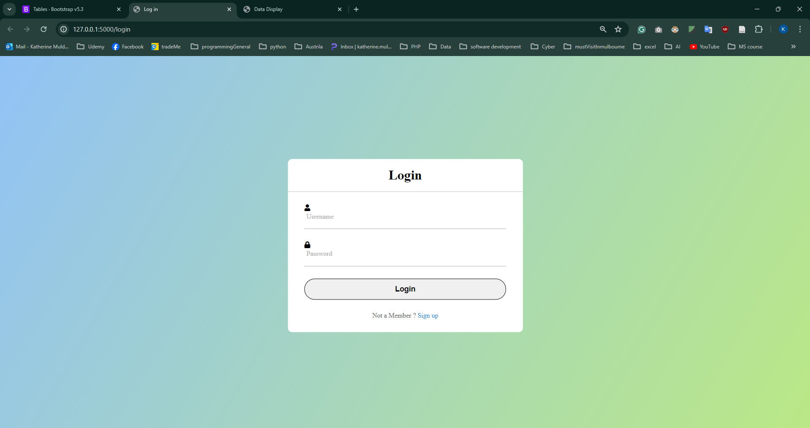
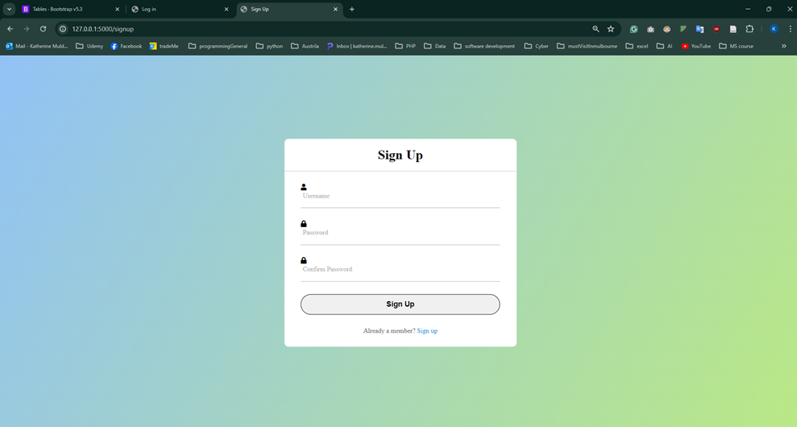
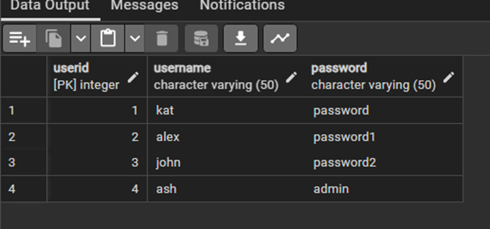
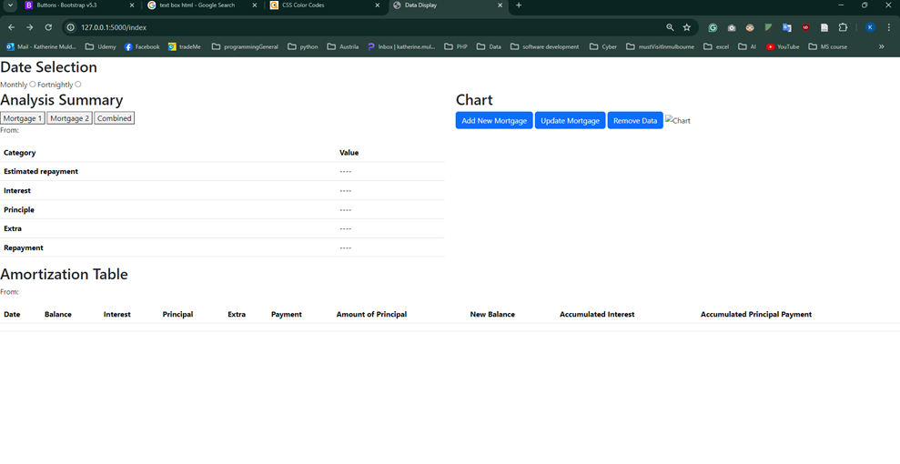
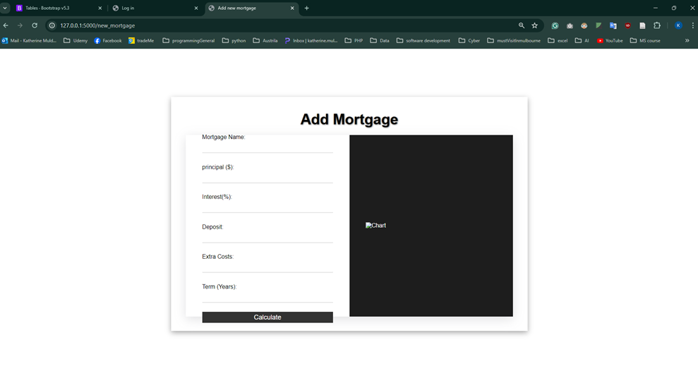
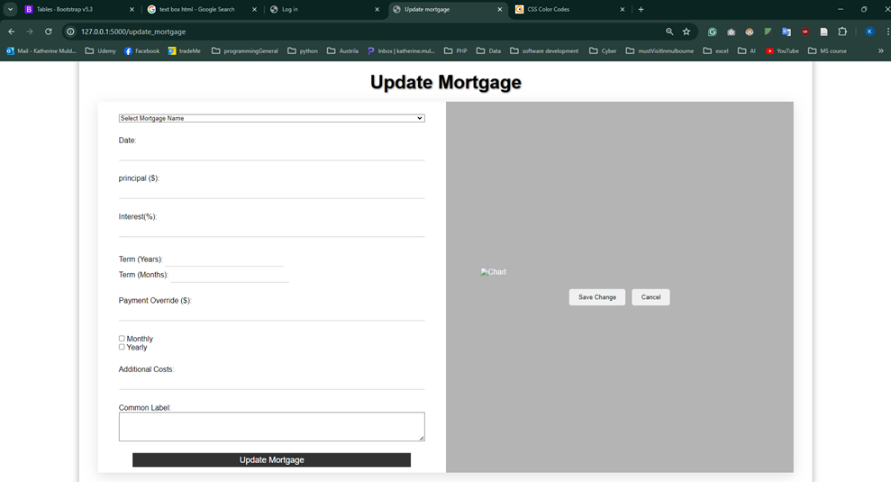
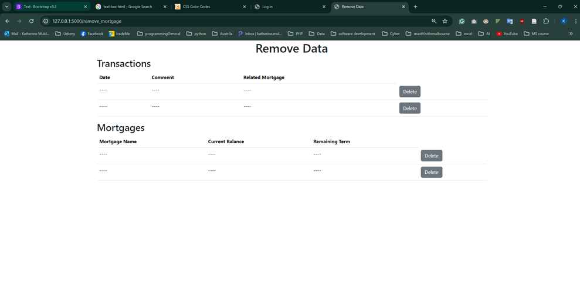

## Progress
Katherine:
* completed all the front end.
1. login page:

2. 
* users will be able to sign up, and it will input the data into the database.

* 
for example, I added ash as username and admin as password.
it shows in the database 

* once users successfully it will show up the index page here. 

 
* add mortgage page: 

* update mortgage 

* remove data page
